# Build CI/CD Pipelines with CDK - Multi Account/Region Deployments

In this sample we introduce a way to build CI/CD pipelines using the CDK to realize multi account/region deployments.  An example use case for this is deployment of software and infrastructure to multiple environments such as Development, QA, Staging, and Production.

&nbsp;

## Stack Architecture

&nbsp;

The following diagram shows the pipeline and target accounts’ regional architecture. The entire architecture spans four accounts. One account is for the deployment pipeline, and the other three accounts are the accounts that the application is deployed to:

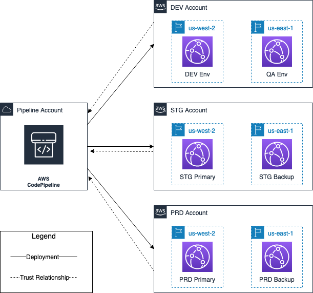

&nbsp;

##  Cross Account Console Setup - Console (Optional but recommended)
During the deployment, we will need to switch between four AWS accounts to check resources. To avoid the time spent to log in and out of accounts, we will leverage roles to get access to different accounts in the console. This step will facilitate switching accounts in the console with 1-click.  The alternative to this approach would be to continuously log in and out of the accounts used by the pipeline, and the accounts the pipeline deploys to.

1. In each of target accounts (prd, stg, dev), using the IAM (Identity and Access Management) service, create a role `OrganizationAccountAccessRole` and configure it to trust the pipeline account, attach policy, add tags, and confirm creation:
   
   * Create role that trusts another AWS account and specify pipeline account ID:
   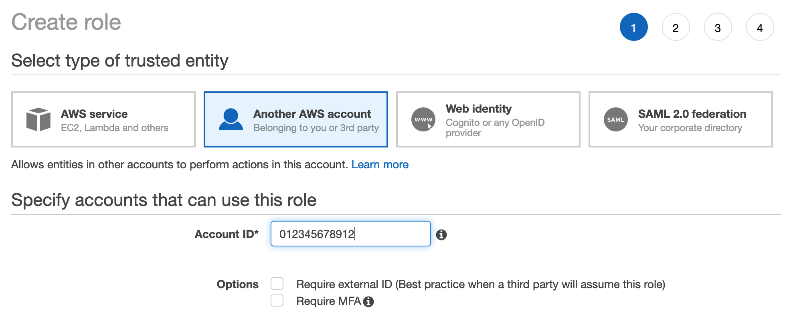

   * Specify policy to attach to trusted role (`AdministratorAccess` used as the pipeline needs to create resources and IAM entities):
   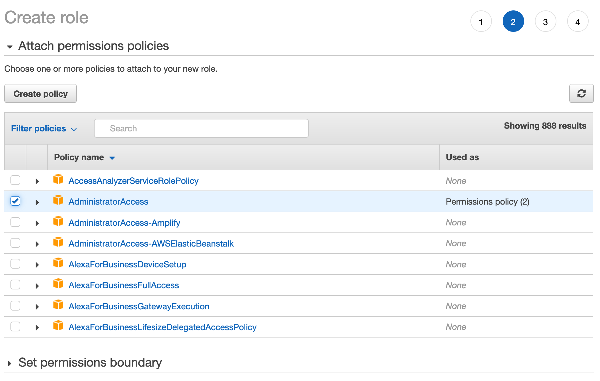
   
   * Review and create the role:
   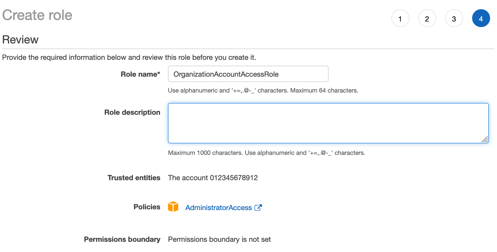

2. In the pipeline account, create a policy as below for each of the target accounts and attach to a role your account can access.
   
   * Policy template:
   ```
      {
         "Version": "2012-10-17",
         "Statement": [
            {
                  "Sid": "VisualEditor0",
                  "Effect": "Allow",
                  "Action": "sts:AssumeRole",
                  "Resource": "arn:aws:iam::<devAccountId>:role/OrganizationAccountAccessRole"
            },
            {
                  "Sid": "VisualEditor1",
                  "Effect": "Allow",
                  "Action": "sts:AssumeRole",
                  "Resource": "arn:aws:iam::<stagingAccountId>:role/OrganizationAccountAccessRole"
            },
            {
                  "Sid": "VisualEditor2",
                  "Effect": "Allow",
                  "Action": "sts:AssumeRole",
                  "Resource": "arn:aws:iam::<productionAccountId>:role/OrganizationAccountAccessRole"
            }
         ]
      }
   ```
   * Create IAM policy:
   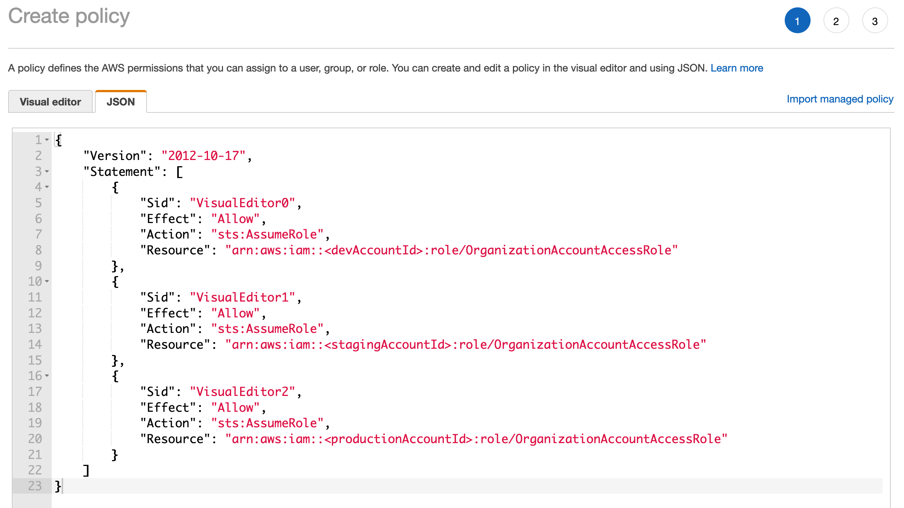

   * Review and name IAM policy:
   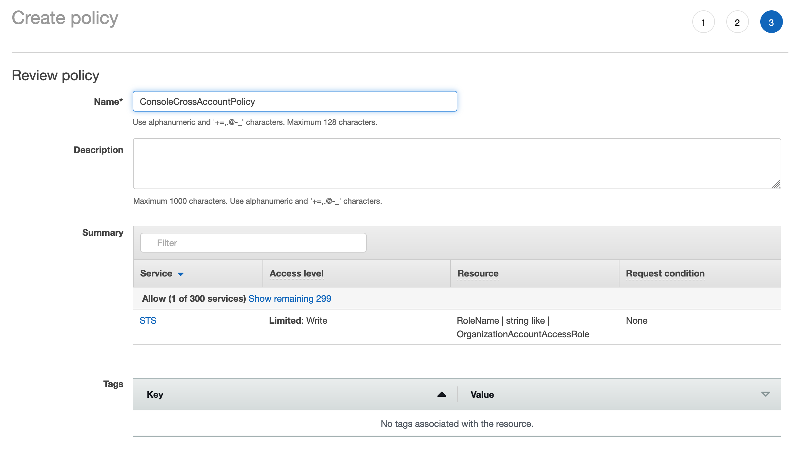

   * Attach policy to role your user has access to:
   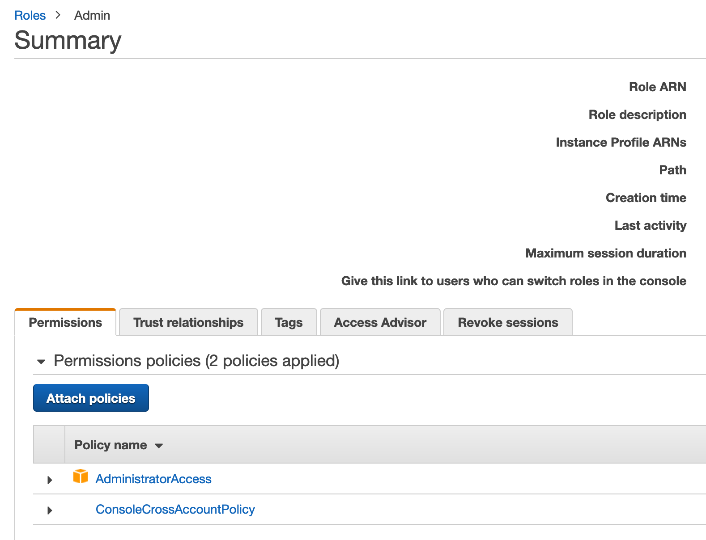

3. Use drop-down menu at top-right of the console to switch between accounts.
   * Click the `Switch role` button:
   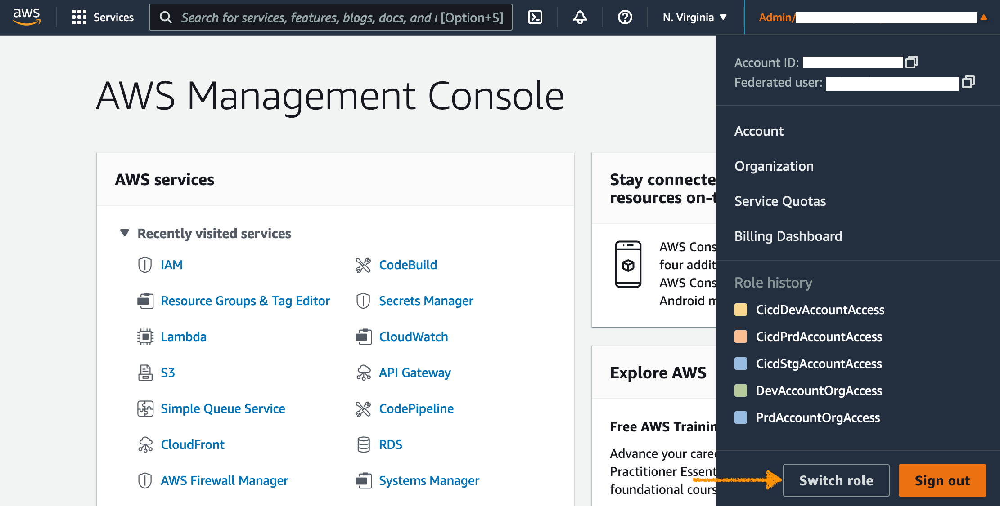  

   * Enter the information of the role you want to assume:
     

   * Notice that roles you switch into are remembered, allowing 1-click role switching in the future:
   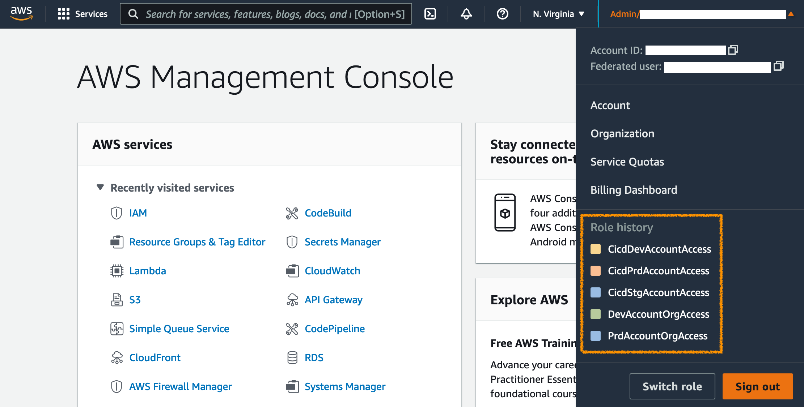  
&nbsp;

## Fork and update the code

The easiest way to start trying out the capabilities of CDK Pipelines with this sample is to fork this repository and make changes in your own fork. After you have created your own fork, clone the repository to your development environment and open the stack file `cdk/lib/cdk-pipeline-stack.ts`. This file contains the pipeline stack definitions, including a set of constants that are needed to provision the full environment. Review and update the constants for GitHub organisation, repository, branch, the three deployment AWS accounts, and regions.

##  Regional CDK Bootstrapping

Each account region combo that is deployed to must be bootstrapped. Since it is a cross-account deployment, a trust must be established during this process.

Deploying AWS CDK apps into an AWS environment may require that you provision resources the AWS CDK needs to perform the deployment. These resources include an Amazon S3 bucket for storing files and IAM roles that grant permissions needed to perform deployments. The process of provisioning these initial resources is called bootstrapping. 

1. For each target account/region run the following CLI command. The command must run with appropriate priveleges in the target account:
    ```
    cdk bootstrap --trust <pipelineAccountId> --cloudformation-execution-policies arn:aws:iam::aws:policy/AdministratorAccess aws://<targetAccountId>/<targetRegion>
    ```

2. Given we are deploying to 2 regions in 3 different accounts, we must run this command 6 times

&nbsp;

##  Initial Deployment of Pipeline

&nbsp;

### Pipeline Overview

`./cdk/bin/pipeline.ts`: Creation of CDK App for Pipeline

`./cdk/lib/cdk-pipeline-stack.ts`: Definition of stacks to deploy, as well as environments to deploy to.

&nbsp;

### Github Access
1. Create a GitHub token [here](https://github.com/settings/tokens/) using an account with access to the forked repo. Set the permission as below
 
   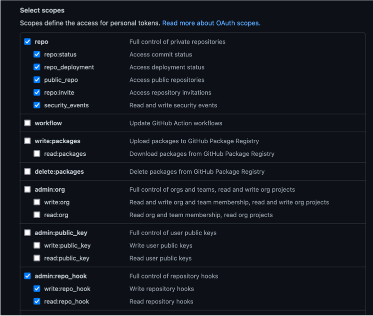

2. In the pipeline account/region, create a secret in [AWS Secrets Manager](https://aws.amazon.com/secrets-manager/) to store access token for GitHub repo.  The token must stored as a plaintext secret with a name of `github-token`:
   
   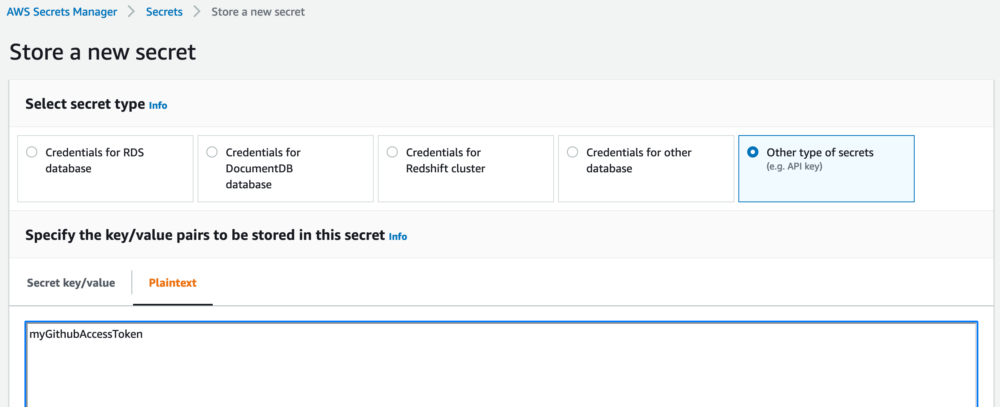

&nbsp;

### Deploy Pipeline

1. Clone the repo and run command. When prompted to create security groups/deploy, accept.
   ```
   cdk deploy CdkPipelineStack
   ```

2. Navigate to CodePipeline in Console and cancel the initial build.
3. Set Env Vars in the Build step of the pipeline as below.

    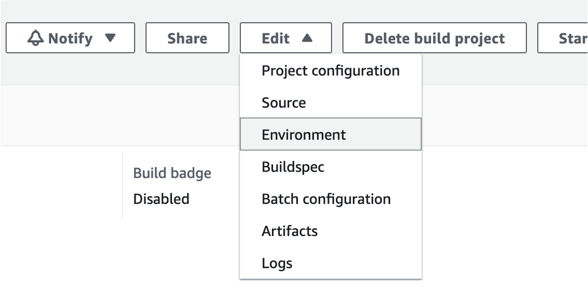

    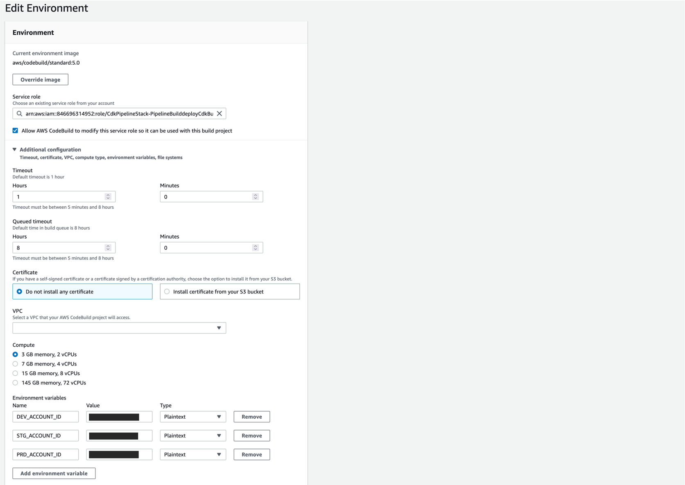

&nbsp;

### Configure Pipeline Role

In pipeline account, create a Policy for each target account to allow Pipeline role to assume Roles created during bootstrap process

1. Get CDK prefix from a target account
   
   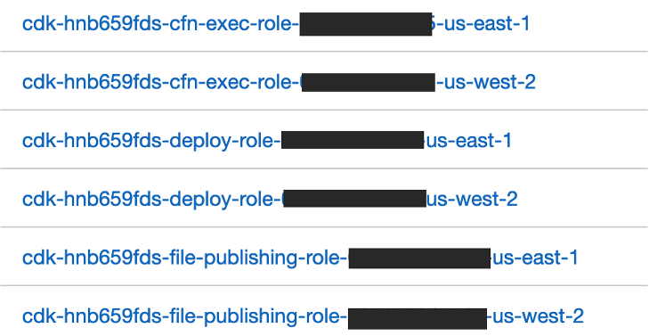

2. Create policy for all 3 accounts
   
   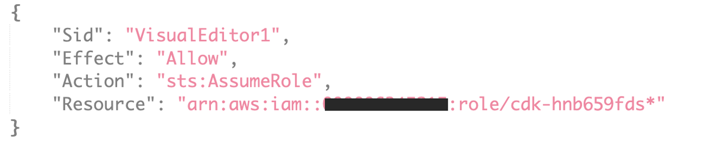

3. Attach all 3 policies to the Pipeline Build role (Very similar to what we did for cross account access in console)
   
   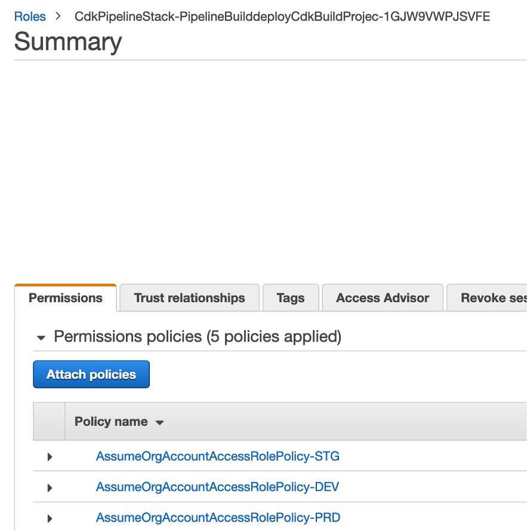

&nbsp;

### Run Pipeline
Navigate to Pipeline and Release Changes, app resources will be deployed in three accounts and two regions in each account.

Waves can be used to deploy multiple stages in parallel. In this example:
- DEV and QA
- PRD and STG Primary 
- PRD and STG Secondary 


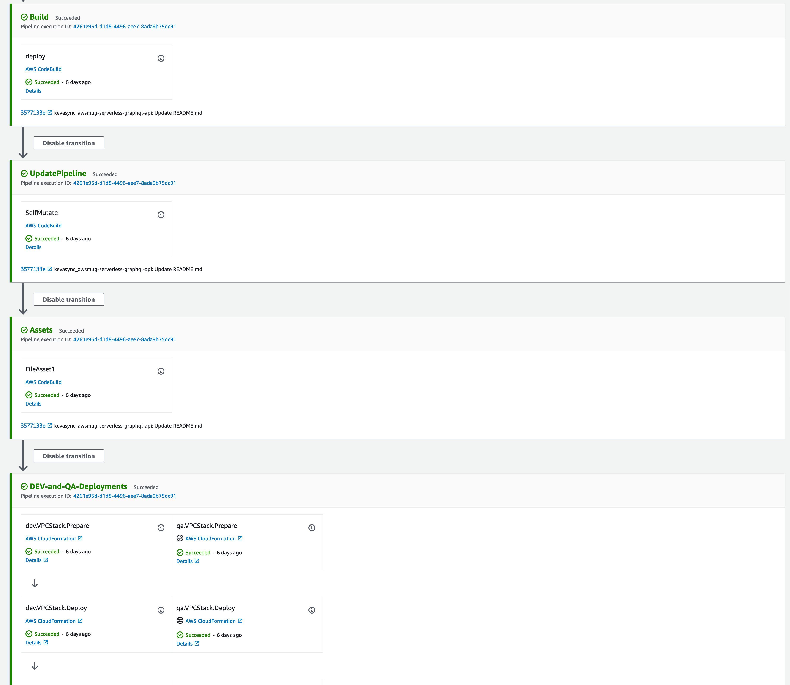

&nbsp;

## App Architecture

App structure contains three stacks:

- VPC: Core networking 
- RDS: RDS Postgres Instance (or read replica in multi-region deployment)
- API: Lambda w/ VPC attachment and API gateway 

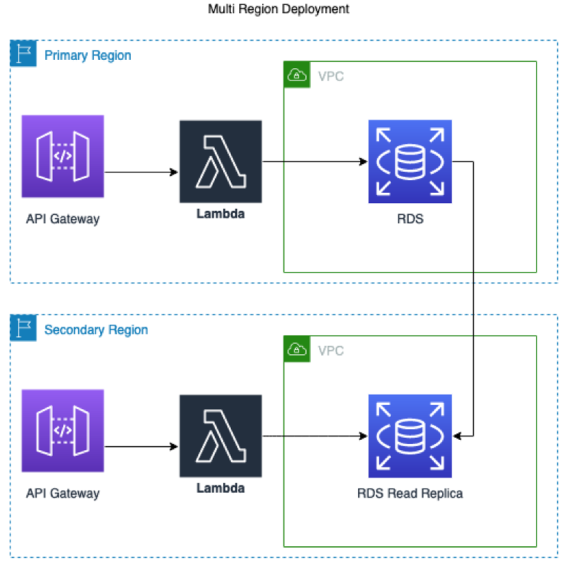

&nbsp;

## Cleanup
Each Stack (VPC, RDS, API) is deployed independently to each account/region
This allows each to be updated separately.

You will need to go CloudFormation in each account/region and delete the stacks when you want to clean up the resources.

Explore nested stacks if this behavior is not acceptable

## Security

See [CONTRIBUTING](CONTRIBUTING.md#security-issue-notifications) for more information.

## License

This library is licensed under the MIT-0 License. See the LICENSE file.
